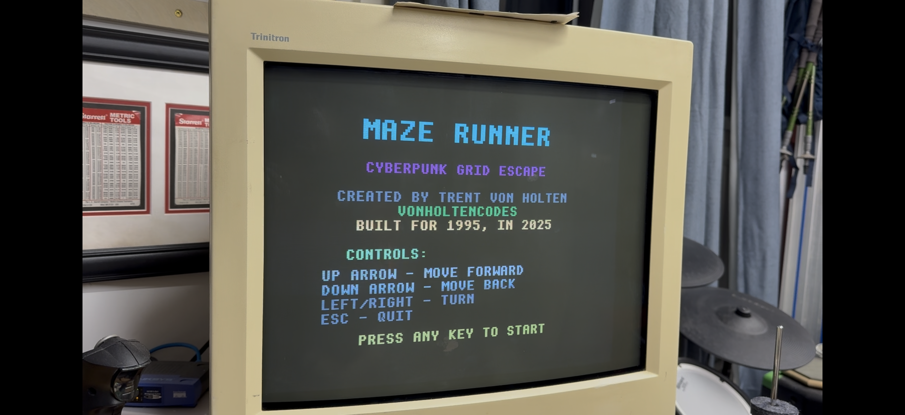
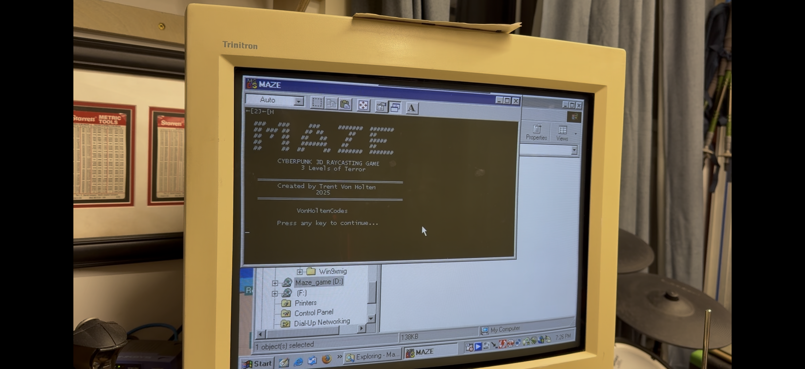
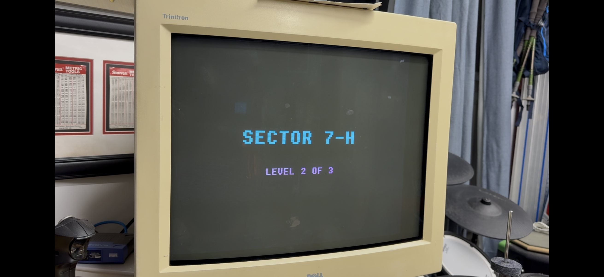
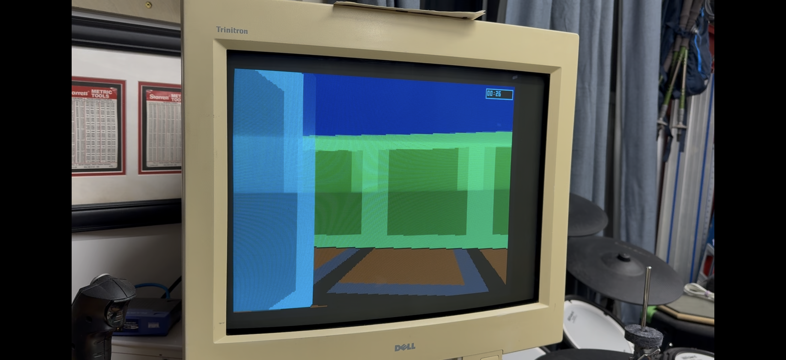
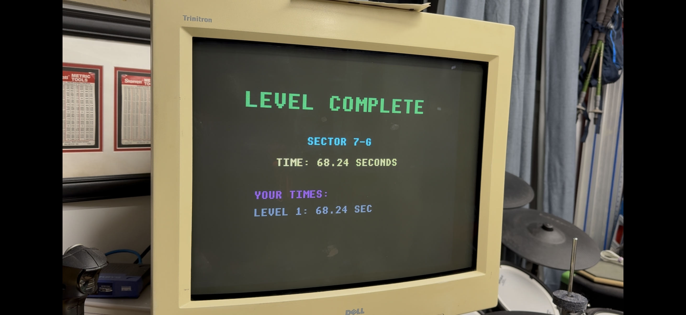
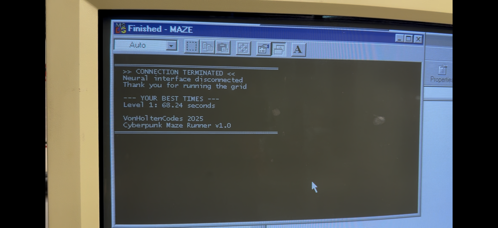

# MAZE RUNNER

<div align="center">



**A Cyberpunk 3D Raycasting Maze Game for MS-DOS**

*Built for 1995, in 2025*

[](LICENSE)
[](https://en.wikipedia.org/wiki/MS-DOS)
[](https://en.wikipedia.org/wiki/C_(programming_language))

[Features](#features) • [Screenshots](#screenshots) • [Installation](#installation) • [Building](#building-from-source) • [Technical Details](#technical-details)

</div>

---

## Overview

**MAZE RUNNER** is a retro-style first-person 3D maze game that runs on genuine MS-DOS and Windows 98 hardware. Navigate through three increasingly challenging cyberpunk sectors using real-time raycasting graphics—the same technology that powered classics like Wolfenstein 3D and Doom.

Escape the neon-lit corporate grid, find the data extraction points, and beat your best times across three unique levels.

---

## Features

### Core Gameplay
- 🎮 **Real-time 3D Raycasting Engine** - Authentic Wolfenstein 3D-style rendering
- 🌃 **Three Unique Sectors** - Each with completely different maze layouts
- ⏱️ **Time Trial Mode** - Track your completion time for each sector
- 🎯 **Progressive Difficulty** - From balanced mazes to claustrophobic corridors

### Technical Excellence
- 🖥️ **VGA Mode 13h Graphics** - Classic 320×200 resolution, 256 colors
- 🔊 **Sound Blaster Audio** - Footstep sounds and victory tones
- 🎵 **PC Speaker Support** - Fallback audio for classic hardware
- 🖼️ **Double-Buffered Rendering** - Smooth, flicker-free graphics
- 💾 **Tiny Footprint** - Only 244KB executable

### Retro Aesthetic
- 🌈 **Cyberpunk Neon Theme** - Cyan grids, magenta holograms, green circuits
- 🎨 **VGA Splash Screens** - Custom 8×8 bitmap font rendering
- 📊 **Level Progression System** - Seamless transitions between sectors
- 🏆 **Victory Animations** - Classic arcade-style celebration

---

## Screenshots

### DOS Boot Sequence

*Classic MS-DOS startup - boots directly into the game*

### Level Introduction

*Each sector has a unique introduction screen with cyberpunk theming*

### In-Game Experience

*Real-time 3D raycasting with distance-based shading and textured walls*

### Victory Screen

*Completion stats with arcade-style victory tones*

### Exit Sequence

*Clean exit back to DOS prompt*

---

## The Three Sectors

### 🔷 Sector 7-G: Maximum Security Zone (Easy)
- **Theme:** Balanced maze with mixed corridors
- **Difficulty:** Beginner-friendly
- **Layout:** Strategic walls with multiple paths

### 🔶 Sector 7-H: Encrypted Archives (Moderate)
- **Theme:** Wide open corridors
- **Difficulty:** Intermediate
- **Layout:** Large spaces with strategic chokepoints

### 🔺 Sector 7-I: Central Core (Extreme)
- **Theme:** Tight narrow passages
- **Difficulty:** Expert
- **Layout:** Claustrophobic 1-tile corridors with complex winding paths

---

## System Requirements

### Minimum Requirements
- **CPU:** Intel 386 or compatible
- **RAM:** 512 KB
- **Graphics:** VGA compatible (640×480)
- **OS:** MS-DOS 3.3 or later
- **Storage:** 1 MB free disk space

### Recommended Requirements
- **CPU:** Intel 486DX or Pentium
- **RAM:** 4 MB
- **Graphics:** VGA with VESA support
- **OS:** MS-DOS 6.22 or Windows 95/98
- **Audio:** Sound Blaster or compatible

### Tested Hardware
- ✅ Real MS-DOS machines (386, 486, Pentium)
- ✅ Windows 98 SE
- ✅ DOSBox (all versions)
- ✅ DOSBox-X
- ✅ QEMU with DOS

---

## Installation

### Option 1: CD-ROM (Authentic Experience)
1. Insert the MAZE RUNNER CD into your DOS machine
2. Navigate to the CD drive (e.g., `D:`)
3. Type `MAZE.EXE` and press Enter
4. Press any key at the splash screen to start

### Option 2: Hard Drive Installation
1. Create a directory: `MD C:\MAZE`
2. Copy all files from CD: `COPY D:\*.* C:\MAZE`
3. Change to directory: `CD C:\MAZE`
4. Run the game: `MAZE.EXE`

### Option 3: DOSBox (Modern Systems)
1. Download and install [DOSBox](https://www.dosbox.com/)
2. Mount the game directory: `MOUNT C ~/maze-runner`
3. Change to C drive: `C:`
4. Run the game: `MAZE.EXE`

---

## Controls

| Key | Action |
|-----|--------|
| `↑` **Up Arrow** | Move forward |
| `↓` **Down Arrow** | Move backward |
| `←` **Left Arrow** | Rotate left |
| `→` **Right Arrow** | Rotate right |
| `W` | Alternative forward |
| `S` | Alternative backward |
| `A` | Alternative rotate left |
| `D` | Alternative rotate right |
| `ESC` | Exit game |

> **Note:** Both arrow keys and WASD controls are supported for maximum compatibility

---

## Building from Source

### Prerequisites
- **DJGPP Cross-Compiler** for Linux/macOS
- **Turbo C++** or **Borland C++** for native DOS compilation
- **Make** (optional)

### Compilation (DJGPP on Linux)

```bash
# Install DJGPP cross-compiler
# Download from: http://www.delorie.com/djgpp/

# Compile the game
i586-pc-msdosdjgpp-gcc -o MAZE.EXE maze.c maze_data.c sound.c -lm -O2

# Create bootable CD image
mkisofs -o MAZE_GAME.iso -V "MAZE_RUNNER" -J -R -l MAZE.EXE README.TXT MAZEMAP.TXT

# Burn to CD (optional)
wodim -v dev=/dev/sr0 -data MAZE_GAME.iso
```

### Compilation (Native DOS)

```batch
REM Using Turbo C++
tcc -mc -O -eMAZE.EXE maze.c maze_data.c sound.c

REM Using Borland C++
bcc -mc -O2 -eMAZE.EXE maze.c maze_data.c sound.c
```

### Project Structure

```
Von_Holten-Maze-Game/
├── maze.c           # Main game engine and rendering
├── maze.h           # Header with constants and structures
├── maze_data.c      # Level layouts and maze data
├── sound.c          # Sound Blaster and PC speaker audio
├── MAZE.EXE         # Compiled executable (244 KB)
├── README.TXT       # DOS-compatible readme
├── MAZEMAP.TXT      # Level maps and reference guide
└── Screenshots/     # Game screenshots
```

---

## Technical Details

### Graphics Architecture
- **Rendering Mode:** VGA Mode 13h (0x13)
- **Resolution:** 320×200 pixels
- **Color Depth:** 8-bit (256 colors)
- **Rendering Technique:** DDA Raycasting (Digital Differential Analyzer)
- **Buffer System:** Double-buffered with VSYNC
- **Draw Distance:** Configurable max depth (20 units default)
- **Field of View:** 66 degrees

### Audio System
- **Primary Output:** Sound Blaster DSP
- **Sample Rate:** 11,025 Hz
- **Format:** 8-bit mono PCM
- **Fallback:** PC Speaker (port I/O)
- **Effects:** Footstep sounds, victory tones

### Game Engine
- **Movement System:** Smooth analog movement (0.1 units/frame)
- **Rotation Speed:** 0.05 radians/frame
- **Collision Detection:** Grid-based with sub-tile precision
- **Map Format:** 24×24 integer grid per level
- **Ray Marching:** 0.02 unit steps

### Code Statistics
- **Language:** ANSI C (C89/C90)
- **Compiler:** DJGPP (GCC 4.7.3 for DOS)
- **Binary Size:** 244 KB (uncompressed)
- **Source Lines:** ~2,500 lines
- **Memory Usage:** ~64 KB framebuffer + heap

---

## Level Design

Each level features a unique layout designed for specific gameplay experiences:

### Level 1: Balanced Exploration
- Mix of tight corridors and open areas
- Multiple path options
- Gradual difficulty increase
- **Start:** (1, 1)
- **Exit:** (12, 22)

### Level 2: Open Navigation
- Wide corridors for faster movement
- Strategic wall placement
- Fewer dead ends
- **Start:** (1, 1)
- **Exit:** (12, 22)

### Level 3: Maximum Challenge
- 1-tile-wide corridors
- Complex winding paths
- High navigation difficulty
- **Start:** (1, 1)
- **Exit:** (12, 22)

See `MAZEMAP.TXT` for complete ASCII maps of all levels.

---

## Development History

### Inspiration
- **Wolfenstein 3D** (id Software, 1992) - Raycasting engine
- **DOOM** (id Software, 1993) - First-person gameplay
- **Descent** (Parallax Software, 1995) - 3D navigation
- **Cyberpunk 2077** (CD Projekt Red) - Aesthetic inspiration
- **BONK DOS Edition** (VonHoltenCodes) - Technical foundation

### Version History

#### v1.0 (2025-10-30)
- ✅ Complete 3-level maze system
- ✅ VGA Mode 13h rendering with double buffering
- ✅ Sound Blaster audio with PC speaker fallback
- ✅ Splash screens with custom bitmap fonts
- ✅ Level progression with time tracking
- ✅ Three completely unique maze layouts
- ✅ Victory animations and completion stats

---

## Credits

### Development
**Created by:** Trent Von Holten
**GitHub:** [@VonHoltenCodes](https://github.com/VonHoltenCodes)
**Year:** 2025

### Special Thanks
- **id Software** - For pioneering raycasting technology
- **DJGPP Team** - For the excellent DOS cross-compiler
- **DOSBox Developers** - For preserving DOS gaming
- **Retro Computing Community** - For keeping the dream alive

### Technology Stack
- **Language:** C (ANSI C89/C90)
- **Compiler:** DJGPP (GCC for DOS)
- **Graphics:** VGA BIOS + Direct Framebuffer
- **Audio:** Sound Blaster DSP + PC Speaker
- **Build Tools:** Make, DJGPP, mkisofs

---

## License

**Educational and Recreational Use**

This software is provided for educational purposes and retro gaming enthusiasts. You are free to:
- Play the game on any compatible hardware
- Study the source code
- Modify for personal use
- Share with the retro computing community

**Restrictions:**
- Commercial use prohibited without permission
- Credit must be maintained in derivative works

---

## Support & Contact

### Issues & Bug Reports
Found a bug? Open an issue on GitHub:
**Repository:** [Von_Holten-Maze-Game](https://github.com/VonHoltenCodes/Von_Holten-Maze-Game)

### Community
- **X/Twitter:** [@VonHoltenCodes](https://twitter.com/VonHoltenCodes)
- **GitHub Discussions:** [Project Discussions](https://github.com/VonHoltenCodes/Von_Holten-Maze-Game/discussions)

### Documentation
- `README.TXT` - DOS-compatible readme
- `MAZEMAP.TXT` - Complete level maps
- Source code comments - Extensive inline documentation

---

## Roadmap

### Potential Future Features
- [ ] Additional maze levels
- [ ] Enemy AI (security bots)
- [ ] Collectible items (keycards, health packs)
- [ ] Door/trigger system
- [ ] High score table
- [ ] AdLib/OPL2 music support
- [ ] SVGA mode support (640×480)

*Contributions and suggestions welcome!*

---

<div align="center">

**MAZE RUNNER**
*Navigate the Grid. Extract the Data. Escape the System.*

**Built with ❤️ for the retro gaming community**

[⬆ Back to Top](#maze-runner)

</div>
